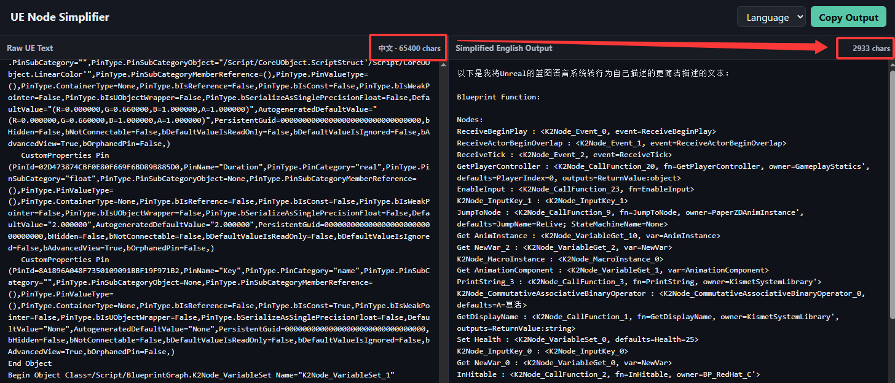
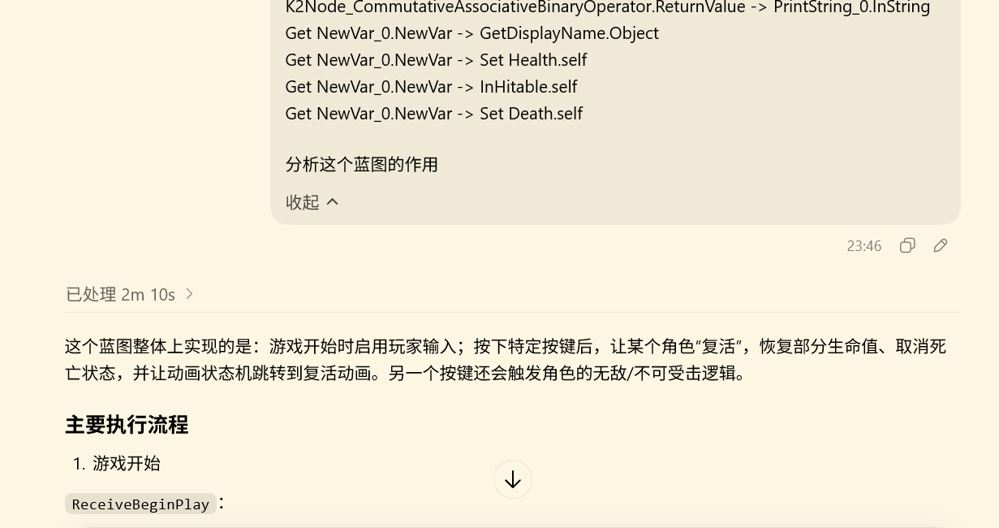

# Unreal Blueprint Simplifier

> [!IMPORTANT]
> **Convert copied Unreal Engine Blueprint nodes into a compact, AI-friendly format with significantly reduced token usage.**
>
> **将复制的 Unreal Engine 蓝图节点转换为精简且对 AI 友好的格式，在保留关键逻辑的同时显著减少 Token 消耗。**

<!-- Add the image URL or relative path inside the parentheses when the preview image is ready. -->

[English](#english) · [中文](#中文)

---

## English

### Overview

Unreal Blueprint Simplifier processes the raw text generated when Blueprint nodes are copied from the Unreal Engine editor. It removes redundant metadata while preserving the essential nodes, properties, pins, values, and connections required to understand the Blueprint's behavior.

The resulting compact representation is designed to be provided to AI models, helping them understand, explain, review, or assist with Blueprint logic while using significantly fewer tokens.

### Why use it?

Blueprint text copied directly from Unreal Engine contains a large amount of engine-specific metadata. Although much of this information is necessary for Unreal Engine to reconstruct the graph, it is often unnecessary when the goal is to communicate the graph's meaning to an AI model.

This tool aims to:

- Reduce unnecessary token consumption.
- Preserve the Blueprint's essential logic and data flow.
- Make node graphs easier for AI models and humans to read.
- Simplify sharing Blueprint logic in prompts, documentation, and technical discussions.

### Workflow

1. Select and copy Blueprint nodes in the Unreal Engine editor.
2. Paste the clipboard text into the simplifier.
3. Convert it into a compact, AI-friendly representation.
4. Include the simplified output in a prompt for an AI model.

### Intended use

The simplified output can help AI models:

- Explain what a Blueprint graph does.
- Identify possible logic errors or unnecessary complexity.
- Suggest refactoring and optimization ideas.
- Translate Blueprint logic into pseudocode or another programming language.
- Assist with documentation and knowledge sharing.

> [!NOTE]
> The simplified representation is intended for analysis and communication. Unless explicitly supported, it should not be treated as a lossless replacement for the original Blueprint clipboard data.

---

## 中文

### 项目简介

Unreal Blueprint Simplifier 用于处理从 Unreal Engine 蓝图编辑器中复制节点时生成的原始文本。它会移除冗余元数据，同时保留理解蓝图行为所需的关键节点、属性、引脚、数值及连接关系。

生成的紧凑表示格式主要用于提供给 AI 模型，使其能够以更少的 Token 理解、解释、审查蓝图逻辑，或协助进行相关开发工作。

### 为什么需要它？

直接从 Unreal Engine 复制的蓝图文本包含大量引擎专用元数据。这些信息对于 Unreal Engine 重新构建节点图可能必不可少，但如果目的只是让 AI 理解蓝图的含义，其中许多内容通常并无必要。

本工具旨在：

- 减少不必要的 Token 消耗。
- 保留蓝图的关键逻辑与数据流。
- 提升蓝图节点信息对 AI 和人类的可读性。
- 简化蓝图逻辑在提示词、文档和技术讨论中的分享过程。

### 使用流程

1. 在 Unreal Engine 蓝图编辑器中选择并复制节点。
2. 将剪贴板中的蓝图文本粘贴到简化器中。
3. 转换为紧凑且对 AI 友好的表示格式。
4. 将简化结果放入提示词并提供给 AI 模型。

### 适用场景

简化后的信息可以帮助 AI：

- 解释蓝图节点图的功能。
- 发现潜在的逻辑错误或不必要的复杂结构。
- 提供重构与优化建议。
- 将蓝图逻辑转换为伪代码或其他编程语言。
- 辅助编写文档和分享技术知识。

---
